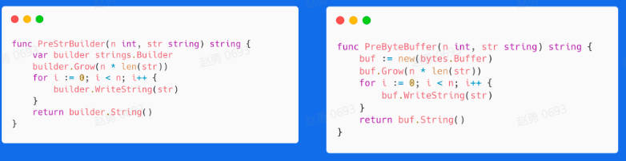
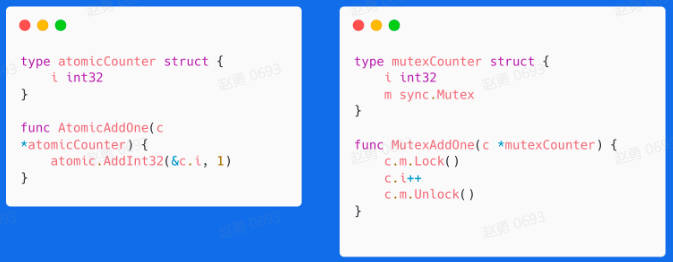

# 高质量编程

`编写的代码能够达到正确可靠、简洁清晰的目标可称之为高质量代码`

## 编码规范

* 代码格式

  * gofmt 
  * goimports 

    等于gofmt加上依赖包管理

* 注释

  * 解释代码作用
  * 解释代码如何做的
  * 解释代码实现原因
  * 解释代码什么情况出错

* 命名规范

  * 简洁
  * 缩略词全大写
  * 距离越远，越需要携带上下文信息

* 控制流程

  * 避免嵌套，保持正常流程清晰
  * 尽量保持正常代码路径为最小缩进

* 错误和异常处理

  * 简单错误

    errors.New来创建匿名变量

    有格式化需求选择 fmt.Errorf

  * 错误的Wrap和Unwrap

    形成error的跟踪链，在fmt.Errorf中使用
    将错误关联致错误链

  * 错误判定
  
    使用 errors.Is
    
    该方法可以判定错误链上所有错误是否含有特定的错误

    使用errors.As

    在错误链上获得特定类型的错误

  * panic
  
    较为严重，不建议在业务代码中使用

    调用函数不包含recover会造成程序崩溃

    若问题可以被屏蔽或解决，建议使用error代替panic

    当程序启动阶段发生不可逆转的错误时，可以在init或main函数中使用panic

  * recover

    只能在被defer的函数中使用

    嵌套无法生效

    只在当前goroutine中生效

    recover后可以在log中记录当前的调用栈

## 性能优化

* Benchmark

  在测试中出现，基准性能测试工具

        go test -bench=. -benchmem
    
* slice
    
    预先分配内存

    尽可能在使用`make()`初始化切片时提供容量信息

        make([]int, 0, size)
    
    大内存未释放，可用copy代替slice 

* map

    和slice相同，make初始化时预先分配内存

* strings.Builder
  
    用于字符串拼接

    +拼接性能最差，string.Bilder和bytes.Buffer相近，strings.Buffer最快

    > strings.Builder，bytes.Buffer底层都是`[]byte`数组
    
    > bytes.Buffer 转换为字符串时重新申请一块空间
    > 
    > strings.Builder直接将底层[]byte转换成了字符串类型返回
    
    

    使用+拼接每次都会重新分配内存
    
    内存扩容策略，不需要每次拼接重新分配内存

* 空结构体
  
    使用空结构体节省内存

* atomic包

    用于多线程编程的场景

    

    > atomic操作是通过硬件实现，而锁是通过操作系统实现
    
    sync.Mutex 应该用来保护一段逻辑，不仅仅保护一个变量

    对于非数值操作，可以使用atomic.Value，能承载一个interface{} 

